# DB_SCHEMA.md — 위드어스 (Withus) 데이터베이스 스키마

> 기준: `docs/prd.md` (PRD v2.3) 7장 · DB: PostgreSQL 17 · 마이그레이션: Flyway `V1__init.sql`

이 문서는 W1에 작성할 `V1__init.sql`의 기준이다. 스키마를 바꿀 때는 이 문서와 새 Flyway 파일을 함께 갱신한다. 이미 적용된 마이그레이션은 수정하지 않는다.

## 1. 공통 규칙

| 항목 | 규칙 |
|---|---|
| 이름 | 테이블·컬럼 소문자 snake_case, 단수형 테이블명 |
| PK | `BIGINT GENERATED ALWAYS AS IDENTITY` (예외: 없음) |
| 시간 | `TIMESTAMPTZ`, 세션 타임존 `Asia/Seoul`. 날짜만 필요한 값은 `DATE` |
| 공통 컬럼 | 모든 테이블에 `created_at`, `updated_at` (`DEFAULT now()`). `updated_at`은 애플리케이션이 갱신 |
| Y/N 값 | `CHAR(1)` + `CHECK (x IN ('Y','N'))` |
| 열거값 | `VARCHAR` + `CHECK` 제약 (PostgreSQL ENUM 타입은 쓰지 않음, 값 추가를 Flyway로 쉽게 하기 위해) |
| JSON | `JSONB` |
| 토큰 | `UUID DEFAULT gen_random_uuid()` (PostgreSQL 13+ 내장) |
| 삭제 | 고객만 논리 삭제(`deleted_yn`). 그 외는 물리 삭제 또는 삭제 금지 |
| 정규화 | 이메일은 소문자·trim, 휴대폰은 숫자만 저장 (애플리케이션에서 저장 전 처리) |

## 2. 테이블 목록 (18종)

| # | 테이블 | 도메인 | 담당 | 설명 |
|---|---|---|---|---|
| 1 | `member` | auth | PL | 시스템 사용자, 역할, 로그인 잠금, Refresh 토큰 해시 |
| 2 | `customer` | customer | 팀원1 | 고객/팬, 수신동의, 휴면, 논리 삭제 |
| 3 | `consent_history` | customer | 팀원1 | 수신동의 변경 이력 |
| 4 | `suppression` | customer | 팀원1 | 수신거부·반송·스팸신고 목록 (영구 보관) |
| 5 | `purchase` | customer | 팀원1 | 관리자 구매 등록 |
| 6 | `segment` | segment | 팀원1 | 세그먼트 마스터 |
| 7 | `segment_rule` | segment | 팀원1 | 세그먼트 조건 JSON |
| 8 | `template` | campaign | 팀원2 | 메일/SMS 템플릿 |
| 9 | `campaign` | campaign | 팀원2 | 일회성·워크플로우 캠페인 |
| 10 | `ab_test` | campaign | 팀원2 | A/B 제목 테스트 |
| 11 | `workflow_step` | workflow | 팀원2 | 워크플로우 노드(설계도) |
| 12 | `workflow_instance` | workflow | 팀원2 | 고객별 워크플로우 진행 상태 |
| 13 | `send_log` | campaign | 팀원2 | 발송 큐 겸 발송 이력 |
| 14 | `track_link` | tracking | 팀원3 | 템플릿별 추적 링크 |
| 15 | `track_event` | tracking | 팀원3 | 오픈·클릭 이벤트 |
| 16 | `coupon` | coupon | 팀원3 | 쿠폰 정의 |
| 17 | `coupon_issue` | coupon | 팀원3 | 고객별 쿠폰 발급 |
| 18 | `ai_report` | ai | 팀원3 | AI 성과 요약 결과 |

## 3. ERD

```mermaid
erDiagram
    member ||--o{ segment : creates
    member ||--o{ template : creates
    member ||--o{ purchase : registers
    customer ||--o{ consent_history : has
    customer ||--o{ purchase : makes
    customer ||--o{ workflow_instance : enters
    customer ||--o{ send_log : receives
    customer ||--o{ coupon_issue : receives
    segment ||--|| segment_rule : defines
    segment ||--o{ campaign : targets
    template ||--o{ campaign : "used by (one-time)"
    template ||--o{ track_link : contains
    coupon ||--o{ campaign : "attached (one-time)"
    coupon ||--o{ coupon_issue : issues
    campaign ||--o| ab_test : has
    campaign ||--o{ workflow_step : defines
    campaign ||--o{ workflow_instance : runs
    campaign ||--o{ send_log : sends
    campaign ||--o{ ai_report : summarizes
    workflow_step ||--o{ workflow_instance : "current step"
    workflow_step ||--o{ send_log : "sent at step"
    workflow_instance ||--o{ send_log : produces
    send_log ||--o{ track_event : tracks
    send_log ||--o| coupon_issue : "issued with"
    track_link ||--o{ track_event : clicked
    coupon_issue ||--o| purchase : "used in"
```



`suppression`은 고객과 FK로 묶지 않는다. 고객이 삭제·재등록되어도 이메일·휴대폰 값 기준으로 계속 적용되어야 하기 때문이다.

## 4. DDL (`V1__init.sql`)

```sql
-- =========================================================
-- 1. member
-- =========================================================
CREATE TABLE member (
    member_id           BIGINT GENERATED ALWAYS AS IDENTITY PRIMARY KEY,
    email               VARCHAR(255) NOT NULL UNIQUE,
    password            VARCHAR(100) NOT NULL,                 -- BCrypt
    name                VARCHAR(50)  NOT NULL,
    role                VARCHAR(20)  NOT NULL CHECK (role IN ('OWNER','MANAGER','STAFF')),
    active_yn           CHAR(1)      NOT NULL DEFAULT 'Y' CHECK (active_yn IN ('Y','N')),
    refresh_token_hash  VARCHAR(128),                          -- 사용자당 세션 1개
    failed_login_count  INT          NOT NULL DEFAULT 0,
    locked_until        TIMESTAMPTZ,                           -- 5회 실패 시 now()+5분
    created_at          TIMESTAMPTZ  NOT NULL DEFAULT now(),
    updated_at          TIMESTAMPTZ  NOT NULL DEFAULT now()
);

-- =========================================================
-- 2. customer
-- =========================================================
CREATE TABLE customer (
    customer_id          BIGINT GENERATED ALWAYS AS IDENTITY PRIMARY KEY,
    name                 VARCHAR(50),
    email                VARCHAR(255) NOT NULL,                -- 소문자·trim 정규화
    phone                VARCHAR(20),                          -- 숫자만
    region_code          VARCHAR(20),                          -- SEOUL, GYEONGGI ...
    birth_date           DATE,                                 -- 만 나이 계산
    joined_at            DATE         NOT NULL,
    total_purchase       BIGINT       NOT NULL DEFAULT 0 CHECK (total_purchase >= 0),
    email_consent_yn     CHAR(1)      NOT NULL DEFAULT 'N' CHECK (email_consent_yn IN ('Y','N')),
    email_consent_at     TIMESTAMPTZ,
    sms_consent_yn       CHAR(1)      NOT NULL DEFAULT 'N' CHECK (sms_consent_yn IN ('Y','N')),
    sms_consent_at       TIMESTAMPTZ,
    dormant_yn           CHAR(1)      NOT NULL DEFAULT 'N' CHECK (dormant_yn IN ('Y','N')),
    dormant_at           TIMESTAMPTZ,
    consent_notified_at  TIMESTAMPTZ,                          -- F-12 직전 안내 일시
    source               VARCHAR(10)  NOT NULL CHECK (source IN ('MANUAL','UPLOAD')),
    deleted_yn           CHAR(1)      NOT NULL DEFAULT 'N' CHECK (deleted_yn IN ('Y','N')),
    created_at           TIMESTAMPTZ  NOT NULL DEFAULT now(),
    updated_at           TIMESTAMPTZ  NOT NULL DEFAULT now()
);

-- 삭제되지 않은 고객 사이에서만 이메일 유일 (재등록 허용)
CREATE UNIQUE INDEX uq_customer_email_active ON customer (email) WHERE deleted_yn = 'N';
CREATE INDEX ix_customer_region         ON customer (region_code);
CREATE INDEX ix_customer_joined_at      ON customer (joined_at);
CREATE INDEX ix_customer_birth_date     ON customer (birth_date);
CREATE INDEX ix_customer_total_purchase ON customer (total_purchase);
CREATE INDEX ix_customer_phone          ON customer (phone);

-- =========================================================
-- 3. consent_history
-- =========================================================
CREATE TABLE consent_history (
    history_id   BIGINT GENERATED ALWAYS AS IDENTITY PRIMARY KEY,
    customer_id  BIGINT      NOT NULL REFERENCES customer (customer_id),
    channel      VARCHAR(10) NOT NULL CHECK (channel IN ('EMAIL','SMS')),
    before_yn    CHAR(1)     CHECK (before_yn IN ('Y','N')),
    after_yn     CHAR(1)     NOT NULL CHECK (after_yn IN ('Y','N')),
    source       VARCHAR(20) NOT NULL CHECK (source IN ('ADMIN','UPLOAD','UNSUBSCRIBE','BOUNCE','COMPLAINT')),
    note         VARCHAR(500),                                 -- 관리자 해제 시 증빙 메모
    changed_at   TIMESTAMPTZ NOT NULL DEFAULT now(),
    created_at   TIMESTAMPTZ NOT NULL DEFAULT now(),
    updated_at   TIMESTAMPTZ NOT NULL DEFAULT now()
);
CREATE INDEX ix_consent_history_customer ON consent_history (customer_id);

-- =========================================================
-- 4. suppression (수신거부 목록, 영구 보관)
-- =========================================================
CREATE TABLE suppression (
    suppression_id  BIGINT GENERATED ALWAYS AS IDENTITY PRIMARY KEY,
    channel         VARCHAR(10)  NOT NULL CHECK (channel IN ('EMAIL','SMS')),
    value           VARCHAR(255) NOT NULL,                     -- 정규화된 이메일 또는 휴대폰
    reason          VARCHAR(20)  NOT NULL CHECK (reason IN ('UNSUBSCRIBE','BOUNCE','COMPLAINT')),
    created_at      TIMESTAMPTZ  NOT NULL DEFAULT now(),
    updated_at      TIMESTAMPTZ  NOT NULL DEFAULT now(),
    CONSTRAINT uq_suppression UNIQUE (channel, value)
);

-- =========================================================
-- 5. segment / 6. segment_rule
-- =========================================================
CREATE TABLE segment (
    segment_id   BIGINT GENERATED ALWAYS AS IDENTITY PRIMARY KEY,
    name         VARCHAR(100) NOT NULL,
    description  VARCHAR(500),
    created_by   BIGINT       NOT NULL REFERENCES member (member_id),
    created_at   TIMESTAMPTZ  NOT NULL DEFAULT now(),
    updated_at   TIMESTAMPTZ  NOT NULL DEFAULT now()
);

CREATE TABLE segment_rule (
    rule_id     BIGINT GENERATED ALWAYS AS IDENTITY PRIMARY KEY,
    segment_id  BIGINT      NOT NULL UNIQUE REFERENCES segment (segment_id) ON DELETE CASCADE,
    rule_json   JSONB       NOT NULL,
    created_at  TIMESTAMPTZ NOT NULL DEFAULT now(),
    updated_at  TIMESTAMPTZ NOT NULL DEFAULT now()
);

-- =========================================================
-- 7. template
-- =========================================================
CREATE TABLE template (
    template_id  BIGINT GENERATED ALWAYS AS IDENTITY PRIMARY KEY,
    channel      VARCHAR(10)  NOT NULL CHECK (channel IN ('EMAIL','SMS')),
    name         VARCHAR(100) NOT NULL,
    subject      VARCHAR(200),                                 -- EMAIL만 필수 (애플리케이션 검증)
    body         TEXT         NOT NULL,
    ad_yn        CHAR(1)      NOT NULL DEFAULT 'Y' CHECK (ad_yn IN ('Y','N')),
    created_by   BIGINT       NOT NULL REFERENCES member (member_id),
    created_at   TIMESTAMPTZ  NOT NULL DEFAULT now(),
    updated_at   TIMESTAMPTZ  NOT NULL DEFAULT now()
);

-- =========================================================
-- 8. coupon (campaign보다 먼저 생성: FK 참조)
-- =========================================================
CREATE TABLE coupon (
    coupon_id            BIGINT GENERATED ALWAYS AS IDENTITY PRIMARY KEY,
    name                 VARCHAR(100) NOT NULL,
    discount_type        VARCHAR(10)  NOT NULL CHECK (discount_type IN ('AMOUNT','RATE')),
    discount_value       INT          NOT NULL CHECK (discount_value > 0),   -- 원 또는 %
    max_discount_amount  INT          CHECK (max_discount_amount > 0),       -- RATE 상한
    valid_from           DATE         NOT NULL,
    valid_to             DATE         NOT NULL,
    created_at           TIMESTAMPTZ  NOT NULL DEFAULT now(),
    updated_at           TIMESTAMPTZ  NOT NULL DEFAULT now(),
    CONSTRAINT ck_coupon_period CHECK (valid_to >= valid_from),
    CONSTRAINT ck_coupon_rate   CHECK (discount_type <> 'RATE' OR (discount_value <= 100 AND max_discount_amount IS NOT NULL))
);

-- =========================================================
-- 9. campaign
-- =========================================================
CREATE TABLE campaign (
    campaign_id   BIGINT GENERATED ALWAYS AS IDENTITY PRIMARY KEY,
    name          VARCHAR(100) NOT NULL,
    type          VARCHAR(10)  NOT NULL CHECK (type IN ('ONE_TIME','WORKFLOW')),
    status        VARCHAR(10)  NOT NULL DEFAULT 'DRAFT'
                  CHECK (status IN ('DRAFT','SCHEDULED','ACTIVE','PAUSED','COMPLETED')),
    segment_id    BIGINT       NOT NULL REFERENCES segment (segment_id),
    template_id   BIGINT       REFERENCES template (template_id),   -- 일회성만
    coupon_id     BIGINT       REFERENCES coupon (coupon_id),       -- 일회성만, 선택
    scheduled_at  TIMESTAMPTZ,
    trigger_type  VARCHAR(30)  CHECK (trigger_type IN ('SEGMENT_SCHEDULED','CUSTOMER_REGISTERED')),
    started_at    TIMESTAMPTZ,
    ended_at      TIMESTAMPTZ,
    created_by    BIGINT       NOT NULL REFERENCES member (member_id),
    created_at    TIMESTAMPTZ  NOT NULL DEFAULT now(),
    updated_at    TIMESTAMPTZ  NOT NULL DEFAULT now(),
    CONSTRAINT ck_campaign_type_fields CHECK (
        (type = 'ONE_TIME' AND trigger_type IS NULL) OR
        (type = 'WORKFLOW' AND template_id IS NULL AND coupon_id IS NULL AND trigger_type IS NOT NULL)
    )
);
CREATE INDEX ix_campaign_status ON campaign (status);

-- =========================================================
-- 10. ab_test
-- =========================================================
CREATE TABLE ab_test (
    ab_test_id        BIGINT GENERATED ALWAYS AS IDENTITY PRIMARY KEY,
    campaign_id       BIGINT       NOT NULL UNIQUE REFERENCES campaign (campaign_id) ON DELETE CASCADE,
    subject_a         VARCHAR(200) NOT NULL,
    subject_b         VARCHAR(200) NOT NULL,
    sample_ratio      NUMERIC(3,2) NOT NULL DEFAULT 0.20 CHECK (sample_ratio > 0 AND sample_ratio < 1),
    decide_after_min  INT          NOT NULL DEFAULT 240 CHECK (decide_after_min > 0),
    winner            CHAR(1)      CHECK (winner IN ('A','B')),
    decided_at        TIMESTAMPTZ,
    created_at        TIMESTAMPTZ  NOT NULL DEFAULT now(),
    updated_at        TIMESTAMPTZ  NOT NULL DEFAULT now()
);

-- =========================================================
-- 11. workflow_step
-- =========================================================
CREATE TABLE workflow_step (
    step_id       BIGINT GENERATED ALWAYS AS IDENTITY PRIMARY KEY,
    campaign_id   BIGINT      NOT NULL REFERENCES campaign (campaign_id) ON DELETE CASCADE,
    node_type     VARCHAR(20) NOT NULL
                  CHECK (node_type IN ('TRIGGER','WAIT','CONDITION','SEND_EMAIL','SEND_SMS','END')),
    config_json   JSONB       NOT NULL DEFAULT '{}'::jsonb,   -- 템플릿·쿠폰·대기 시간·조건
    next_step_id  BIGINT      REFERENCES workflow_step (step_id),
    yes_step_id   BIGINT      REFERENCES workflow_step (step_id),
    no_step_id    BIGINT      REFERENCES workflow_step (step_id),
    depth         SMALLINT    NOT NULL DEFAULT 0 CHECK (depth BETWEEN 0 AND 2),  -- CONDITION 중첩 수
    created_at    TIMESTAMPTZ NOT NULL DEFAULT now(),
    updated_at    TIMESTAMPTZ NOT NULL DEFAULT now()
);
CREATE INDEX ix_workflow_step_campaign ON workflow_step (campaign_id);

-- =========================================================
-- 12. workflow_instance
-- =========================================================
CREATE TABLE workflow_instance (
    instance_id      BIGINT GENERATED ALWAYS AS IDENTITY PRIMARY KEY,
    campaign_id      BIGINT      NOT NULL REFERENCES campaign (campaign_id),
    customer_id      BIGINT      NOT NULL REFERENCES customer (customer_id),
    current_step_id  BIGINT      NOT NULL REFERENCES workflow_step (step_id),
    status           VARCHAR(10) NOT NULL DEFAULT 'WAITING'
                     CHECK (status IN ('WAITING','RUNNING','COMPLETED','FAILED','CANCELLED')),
    next_run_at      TIMESTAMPTZ,              -- NULL + WAITING = 직전 SEND 발송 완료 대기
    retry_count      INT         NOT NULL DEFAULT 0,
    last_error       TEXT,
    created_at       TIMESTAMPTZ NOT NULL DEFAULT now(),
    updated_at       TIMESTAMPTZ NOT NULL DEFAULT now(),  -- RUNNING 10분 초과 복구 판단에 사용
    CONSTRAINT uq_workflow_instance UNIQUE (campaign_id, customer_id)
);
CREATE INDEX ix_workflow_instance_due ON workflow_instance (status, next_run_at);

-- =========================================================
-- 13. send_log (발송 큐 겸 이력)
-- =========================================================
CREATE TABLE send_log (
    send_log_id          BIGINT GENERATED ALWAYS AS IDENTITY PRIMARY KEY,
    campaign_id          BIGINT       REFERENCES campaign (campaign_id),       -- NOTICE·TEST는 NULL
    instance_id          BIGINT       REFERENCES workflow_instance (instance_id),
    step_id              BIGINT       REFERENCES workflow_step (step_id),
    customer_id          BIGINT       REFERENCES customer (customer_id),       -- TEST는 NULL
    recipient            VARCHAR(255) NOT NULL,                                -- 적재 시점 이메일/휴대폰
    channel              VARCHAR(10)  NOT NULL CHECK (channel IN ('EMAIL','SMS')),
    ab_variant           CHAR(1)      CHECK (ab_variant IN ('A','B')),
    status               VARCHAR(10)  NOT NULL DEFAULT 'PENDING'
                         CHECK (status IN ('PENDING','SENDING','SENT','FAILED','SKIPPED','BOUNCED')),
    kind                 VARCHAR(10)  NOT NULL DEFAULT 'CAMPAIGN' CHECK (kind IN ('CAMPAIGN','NOTICE','TEST')),
    priority             SMALLINT     NOT NULL CHECK (priority BETWEEN 1 AND 3),  -- 1 TEST, 2 WORKFLOW·NOTICE, 3 대량
    provider_message_id  VARCHAR(200),
    tracking_token       UUID         NOT NULL DEFAULT gen_random_uuid(),
    attempt_count        INT          NOT NULL DEFAULT 0,
    next_attempt_at      TIMESTAMPTZ,
    error_message        VARCHAR(500),                                         -- 사유 코드 포함 (COUPON_INVALID, UNKNOWN_RESULT ...)
    sent_at              TIMESTAMPTZ,
    created_at           TIMESTAMPTZ  NOT NULL DEFAULT now(),
    updated_at           TIMESTAMPTZ  NOT NULL DEFAULT now(),                  -- SENDING 10분 초과 판단에 사용
    CONSTRAINT uq_send_log_step           UNIQUE (instance_id, step_id),
    CONSTRAINT uq_send_log_tracking_token UNIQUE (tracking_token)
);
-- 일회성·A/B: 한 캠페인에서 고객당 1건
CREATE UNIQUE INDEX uq_send_log_one_time ON send_log (campaign_id, customer_id) WHERE instance_id IS NULL;
-- 발송 큐 조회용
CREATE INDEX ix_send_log_queue    ON send_log (priority, next_attempt_at, send_log_id) WHERE status = 'PENDING';
CREATE INDEX ix_send_log_sending  ON send_log (updated_at) WHERE status = 'SENDING';
CREATE INDEX ix_send_log_campaign ON send_log (campaign_id);
CREATE INDEX ix_send_log_customer ON send_log (customer_id);
CREATE INDEX ix_send_log_provider ON send_log (provider_message_id);

-- =========================================================
-- 14. track_link / 15. track_event
-- =========================================================
CREATE TABLE track_link (
    link_id       BIGINT GENERATED ALWAYS AS IDENTITY PRIMARY KEY,
    template_id   BIGINT      NOT NULL REFERENCES template (template_id),  -- 삭제하지 않음
    original_url  TEXT        NOT NULL,
    link_order    INT         NOT NULL,
    created_at    TIMESTAMPTZ NOT NULL DEFAULT now(),
    updated_at    TIMESTAMPTZ NOT NULL DEFAULT now()
);
CREATE INDEX ix_track_link_template ON track_link (template_id);

CREATE TABLE track_event (
    event_id     BIGINT GENERATED ALWAYS AS IDENTITY PRIMARY KEY,
    send_log_id  BIGINT       NOT NULL REFERENCES send_log (send_log_id),
    event_type   VARCHAR(10)  NOT NULL CHECK (event_type IN ('OPEN','CLICK')),
    link_id      BIGINT       REFERENCES track_link (link_id),          -- CLICK만
    user_agent   VARCHAR(500),
    ip_hash      CHAR(64),                                              -- SHA-256 hex
    bot_yn       CHAR(1)      NOT NULL DEFAULT 'N' CHECK (bot_yn IN ('Y','N')),
    occurred_at  TIMESTAMPTZ  NOT NULL DEFAULT now(),
    created_at   TIMESTAMPTZ  NOT NULL DEFAULT now(),
    updated_at   TIMESTAMPTZ  NOT NULL DEFAULT now()
);
CREATE INDEX ix_track_event_send_log ON track_event (send_log_id, event_type);
CREATE INDEX ix_track_event_occurred ON track_event (occurred_at);

-- =========================================================
-- 16. coupon_issue / 17. purchase
-- =========================================================
CREATE TABLE coupon_issue (
    issue_id     BIGINT GENERATED ALWAYS AS IDENTITY PRIMARY KEY,
    coupon_id    BIGINT      NOT NULL REFERENCES coupon (coupon_id),
    customer_id  BIGINT      NOT NULL REFERENCES customer (customer_id),
    send_log_id  BIGINT      UNIQUE REFERENCES send_log (send_log_id),  -- 발송 1건당 발급 1건
    token        UUID        NOT NULL UNIQUE DEFAULT gen_random_uuid(),
    issued_at    TIMESTAMPTZ NOT NULL DEFAULT now(),
    used_at      TIMESTAMPTZ,
    created_at   TIMESTAMPTZ NOT NULL DEFAULT now(),
    updated_at   TIMESTAMPTZ NOT NULL DEFAULT now()
);
CREATE INDEX ix_coupon_issue_coupon_customer ON coupon_issue (coupon_id, customer_id);

CREATE TABLE purchase (
    purchase_id      BIGINT GENERATED ALWAYS AS IDENTITY PRIMARY KEY,
    customer_id      BIGINT      NOT NULL REFERENCES customer (customer_id),
    amount           BIGINT      NOT NULL CHECK (amount > 0),
    coupon_issue_id  BIGINT      REFERENCES coupon_issue (issue_id),
    created_by       BIGINT      NOT NULL REFERENCES member (member_id),   -- 관리자 등록만 존재
    purchased_at     TIMESTAMPTZ NOT NULL DEFAULT now(),
    created_at       TIMESTAMPTZ NOT NULL DEFAULT now(),
    updated_at       TIMESTAMPTZ NOT NULL DEFAULT now()
);
CREATE INDEX ix_purchase_customer ON purchase (customer_id);
-- 쿠폰 1건은 구매 1건에만 연결
CREATE UNIQUE INDEX uq_purchase_coupon_issue ON purchase (coupon_issue_id) WHERE coupon_issue_id IS NOT NULL;

-- =========================================================
-- 18. ai_report
-- =========================================================
CREATE TABLE ai_report (
    report_id    BIGINT GENERATED ALWAYS AS IDENTITY PRIMARY KEY,
    campaign_id  BIGINT      NOT NULL REFERENCES campaign (campaign_id),
    report_type  VARCHAR(30) NOT NULL DEFAULT 'CAMPAIGN_SUMMARY',
    input_json   JSONB       NOT NULL,             -- 집계 지표만, 개인정보 없음
    content      TEXT        NOT NULL,
    model        VARCHAR(50) NOT NULL,
    created_at   TIMESTAMPTZ NOT NULL DEFAULT now(),
    updated_at   TIMESTAMPTZ NOT NULL DEFAULT now()
);
CREATE INDEX ix_ai_report_campaign ON ai_report (campaign_id);
```

## 5. JSON 컬럼 형식

### 5.1 `segment_rule.rule_json`

```json
{
  "operator": "AND",
  "groups": [
    {
      "operator": "OR",
      "conditions": [
        { "field": "region", "op": "IN", "value": ["SEOUL", "GYEONGGI"] },
        { "field": "totalPurchase", "op": "GTE", "value": 100000 }
      ]
    },
    {
      "operator": "AND",
      "conditions": [
        { "field": "age", "op": "BETWEEN", "value": [20, 34] },
        { "field": "joinedAt", "op": "IN_LAST_DAYS", "value": 90 }
      ]
    }
  ]
}
```

| field | 매핑 컬럼 | 허용 연산자 | value 형식 |
|---|---|---|---|
| `region` | `region_code` | EQ, NE, IN | 코드 문자열 / 배열 |
| `age` | `birth_date` (만 나이 계산) | EQ, GT, GTE, LT, LTE, BETWEEN | 정수 / [min, max] |
| `joinedAt` | `joined_at` | BETWEEN, IN_LAST_DAYS | ["YYYY-MM-DD","YYYY-MM-DD"] / 정수(일) |
| `totalPurchase` | `total_purchase` | EQ, GT, GTE, LT, LTE, BETWEEN | 정수 / [min, max] |
| `emailConsent` | `email_consent_yn` | EQ | "Y" / "N" |
| `smsConsent` | `sms_consent_yn` | EQ | "Y" / "N" |
| `dormant` | `dormant_yn` | EQ | "Y" / "N" |

- 그룹은 1단계까지, 조건은 합계 10개까지.
- 필드·연산자는 위 표의 화이트리스트로만 SQL에 매핑한다. 모든 세그먼트 쿼리에 `deleted_yn = 'N'`이 항상 붙는다.
- 만 나이 조건 예: `age BETWEEN 20 AND 34` → `birth_date > (CURRENT_DATE - INTERVAL '35 years') AND birth_date <= (CURRENT_DATE - INTERVAL '20 years')`.

### 5.2 `workflow_step.config_json`

| node_type | 형식 |
|---|---|
| `TRIGGER` | `{ "triggerType": "CUSTOMER_REGISTERED" }` |
| `WAIT` | `{ "amount": 2, "unit": "DAY" }` (unit: MINUTE, HOUR, DAY) |
| `CONDITION` | `{ "condition": "EMAIL_CLICKED" }` 또는 `{ "condition": "PURCHASE_GTE", "amount": 100000 }` |
| `SEND_EMAIL` / `SEND_SMS` | `{ "templateId": 12, "couponId": 3 }` (couponId 선택) |
| `END` | `{}` |

## 6. 상태 전이 요약

**`send_log.status`**

```
PENDING ──(잡기·커밋)──▶ SENDING ──(성공)──▶ SENT ──(SES 반송 웹훅)──▶ BOUNCED
   ▲                        │
   │(일시 오류, 3회까지)     ├──(영구 오류/3회 초과)──▶ FAILED
   └────────────────────────┤
                            └──(10분 초과, 결과 불명)──▶ FAILED (UNKNOWN_RESULT)
PENDING ──(발송 직전 재확인 실패)──▶ SKIPPED
```

**`workflow_instance.status`**: `WAITING` → `RUNNING` → (`WAITING` | `COMPLETED` | `FAILED`), 캠페인 종료·고객 삭제 시 `CANCELLED`. `RUNNING`으로 10분 넘게 남으면 `WAITING`으로 복구.

**`campaign.status`**: PRD 6.7 참고.

## 7. 주요 쿼리 패턴

```sql
-- 발송 큐: 우선순위 순으로 잡아 SENDING으로 바꾸기 (한 트랜잭션, 바로 커밋)
UPDATE send_log SET status = 'SENDING', updated_at = now()
WHERE send_log_id IN (
    SELECT send_log_id FROM send_log
    WHERE status = 'PENDING' AND (next_attempt_at IS NULL OR next_attempt_at <= now())
    ORDER BY priority, send_log_id
    LIMIT 50
    FOR UPDATE SKIP LOCKED
)
RETURNING *;

-- 워크플로우: 실행할 인스턴스 잡기 (500건씩 반복)
UPDATE workflow_instance SET status = 'RUNNING', updated_at = now()
WHERE instance_id IN (
    SELECT instance_id FROM workflow_instance
    WHERE status = 'WAITING' AND next_run_at <= now()
    ORDER BY next_run_at
    LIMIT 500
    FOR UPDATE SKIP LOCKED
)
RETURNING *;

-- 멈춤 복구
UPDATE workflow_instance SET status = 'WAITING', next_run_at = now()
WHERE status = 'RUNNING' AND updated_at < now() - INTERVAL '10 minutes';

UPDATE send_log SET status = 'FAILED', error_message = 'UNKNOWN_RESULT'
WHERE status = 'SENDING' AND updated_at < now() - INTERVAL '10 minutes';
```

## 8. PRD 대비 보완한 컬럼

PRD 7장에 없지만 구현에 필요해 추가했다. PRD 갱신 대상이다.

| 테이블 | 컬럼 | 이유 |
|---|---|---|
| `send_log` | `recipient` | 테스트 발송(고객 없음)과 발송 시점 주소 기록 |
| `consent_history` | `note` | 관리자가 수신거부를 해제할 때 증빙 메모 |
| `campaign` | `created_by` | 작성자 추적 (다른 마스터 테이블과 일관성) |

## 9. 시드 데이터 (`V2__seed_local.sql`, local 프로필 전용)

- OWNER 계정은 시드가 아니라 애플리케이션 시작 시 환경변수로 1개 생성한다.
- 로컬 시연용: 고객 100명(지역·나이·구매액 분포), 세그먼트 2개, 템플릿 3개(메일 2, SMS 1), 쿠폰 2개(정액·정률).
- Flyway `locations`를 프로필별로 나눠 운영 DB에는 시드가 들어가지 않게 한다.
